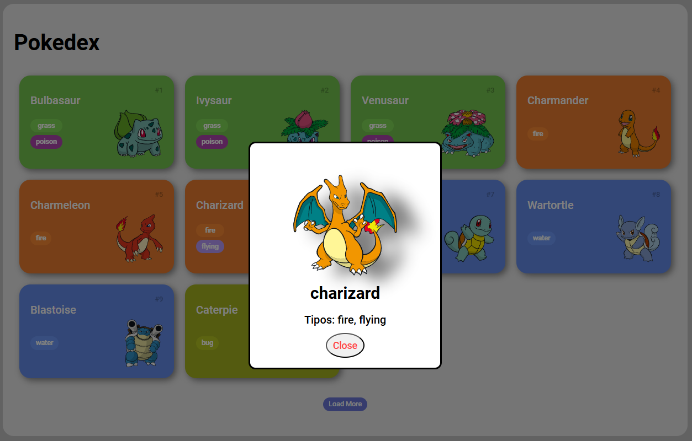

# Desafio Pokedex DIO  

Este projeto foi desenvolvido como parte de um desafio da [Digital Innovation One](https://www.dio.me/). Ele consiste em uma Pokédex interativa que apresenta detalhes sobre diferentes Pokémon, como nome, tipo e imagem principal.  

## Demonstração  

  

## Funcionalidades  

- Listagem de Pokémon com imagens e informações básicas.
- Modal para exibição detalhada do Pokémon selecionado:
  - Nome.
  - Tipos.
  - Imagem principal.

## Tecnologias Utilizadas  

- **HTML5**
- **CSS3**
- **JavaScript**
- **API de Pokémon**  

## Estrutura do Projeto  

```plaintext
📂 desafioPokedexDIO
├── 📂 assets
│   ├── 📂 css
│   ├── 📂 images
│   └── 📂 js
├── 📄 index.html
└── 📄 README.md
```

---

# Como Executar
- Clone este repositório, utilizando o terminal de sua preferência:
    * Copiar código

```
git clone https://github.com/marcelodecarli/desafioPokedexDIO.git
```

- Navegue até a pasta do projeto:
    * Copiar código
```
cd desafioPokedexDIO
```
- Abra o arquivo index.html no navegador para visualizar o projeto.

